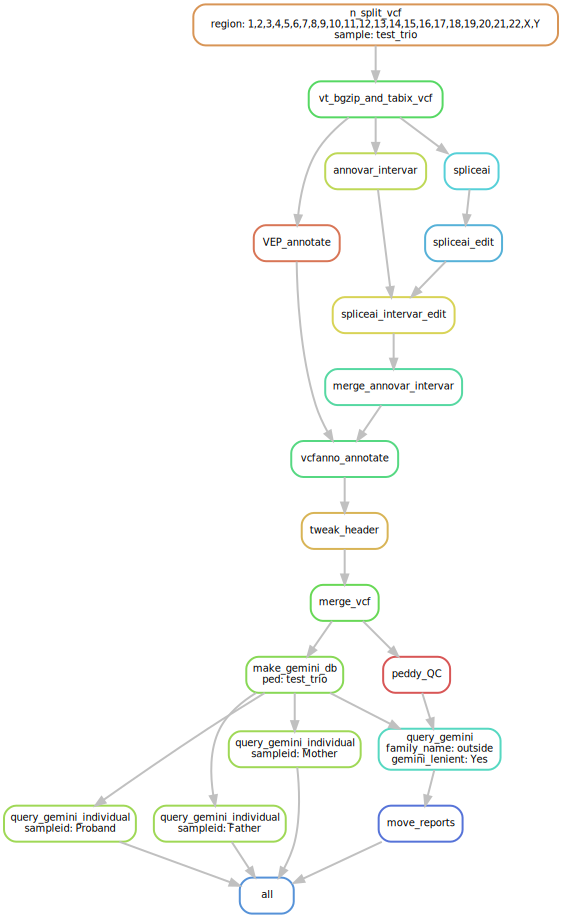

# Genomic Variant Prioritization
Snakemake workflow post-genotype calling to prioritize disease-causing variants on biowulf2.

# Quick-ish slivar Start Using Demo vcf

## on biowolf, unless you already have ~/git

```bash
mkdir -p ~/git
```

## on biowulf, unless you already have Bin-Guan/variant_prioritization

```bash
cd ~/git
git clone https://github.com/Bin-Guan/variant_prioritization.git
```

## on biowulf, uless you already have the slivar branch checked out

```bash
cd ~/git/variant_prioritization
git checkout slivar
```

## on interactive node

```bash
sinteractive

module load snakemake/7.32.4
cd /data/OGL/genome/ChileMAC
ls -l
total 4605451
-rw-r-----. 1 vanettenwj OGL 4713444568 Mar 31 15:20 ChileMAC.fbDv.anno.vcf.gz
-rw-rw----. 1 vanettenwj OGL    2536226 Mar 31 15:32 ChileMAC.fbDv.anno.vcf.gz.tbi
-rw-r-----. 1 vanettenwj OGL        274 Mar 31 15:21 ChileMAC.ped

snakemake -n -s "/home/$USER/git/variant_prioritization/src_hg38/Snakefile" --configfile "/home/$USER/git/variant_prioritization/config_variant_prioritization.yaml" --cores all
Would remove temporary output dummy.txt
Job stats:
job                     count
--------------------  -------
all                         1
dummy                       1
filter_slivar_family        4
query_slivar_sample         1
total                       7

snakemake -s "/home/$USER/git/variant_prioritization/src_hg38/Snakefile" --configfile "/home/$USER/git/variant_prioritization/config_variant_prioritization.yaml" --cores all

[vanettenwj@cn4317 ChileMAC]$ ls -l
total 16050527
-rw-rw---- 1 vanettenwj OGL 2029551814 Apr  7 17:18 ChileMAC.fbDv.anno.ChileMAC.bcf
-rw-r----- 1 vanettenwj OGL 4713444568 Mar 31 15:20 ChileMAC.fbDv.anno.vcf.gz
-rw-rw---- 1 vanettenwj OGL    2536226 Mar 31 15:32 ChileMAC.fbDv.anno.vcf.gz.tbi
-rw-r----- 1 vanettenwj OGL        274 Mar 31 15:21 ChileMAC.ped
-rw-rw---- 1 vanettenwj OGL  245001118 Apr  7 17:41 RYF1.ChileMAC.fbDv.anno.ChileMAC.ad.tsv
-rw-rw---- 1 vanettenwj OGL  169407543 Apr  7 17:41 RYF1.ChileMAC.fbDv.anno.ChileMAC.ar.tsv
-rw-rw---- 1 vanettenwj OGL 1750510183 Apr  7 17:41 RYF1.ChileMAC.fbDv.anno.ChileMAC.bcf
-rw-rw---- 1 vanettenwj OGL  250949259 Apr  7 17:41 RYF1.ChileMAC.fbDv.anno.ChileMAC.comphets.tsv
-rw-rw---- 1 vanettenwj OGL      37160 Apr  7 17:41 RYF1.ChileMAC.fbDv.anno.ChileMAC.denovo.tsv
-rw-rw---- 1 vanettenwj OGL      28534 Apr  7 17:41 RYF1.ChileMAC.fbDv.anno.ChileMAC.xdenovo.tsv
-rw-rw---- 1 vanettenwj OGL    7392919 Apr  7 17:41 RYF1.ChileMAC.fbDv.anno.ChileMAC.xd.tsv
-rw-rw---- 1 vanettenwj OGL   10223949 Apr  7 17:41 RYF1.ChileMAC.fbDv.anno.ChileMAC.xr.tsv
-rw-rw---- 1 vanettenwj OGL  245001118 Apr  7 17:30 RYF2.ChileMAC.fbDv.anno.ChileMAC.ad.tsv
-rw-rw---- 1 vanettenwj OGL  169407543 Apr  7 17:30 RYF2.ChileMAC.fbDv.anno.ChileMAC.ar.tsv
-rw-rw---- 1 vanettenwj OGL 1750227444 Apr  7 17:30 RYF2.ChileMAC.fbDv.anno.ChileMAC.bcf
-rw-rw---- 1 vanettenwj OGL  250949259 Apr  7 17:30 RYF2.ChileMAC.fbDv.anno.ChileMAC.comphets.tsv
-rw-rw---- 1 vanettenwj OGL      37160 Apr  7 17:30 RYF2.ChileMAC.fbDv.anno.ChileMAC.denovo.tsv
-rw-rw---- 1 vanettenwj OGL      28534 Apr  7 17:30 RYF2.ChileMAC.fbDv.anno.ChileMAC.xdenovo.tsv
-rw-rw---- 1 vanettenwj OGL    7392919 Apr  7 17:30 RYF2.ChileMAC.fbDv.anno.ChileMAC.xd.tsv
-rw-rw---- 1 vanettenwj OGL   10223949 Apr  7 17:30 RYF2.ChileMAC.fbDv.anno.ChileMAC.xr.tsv
-rw-rw---- 1 vanettenwj OGL  245001118 Apr  7 17:41 RYF3.ChileMAC.fbDv.anno.ChileMAC.ad.tsv
-rw-rw---- 1 vanettenwj OGL  169407543 Apr  7 17:41 RYF3.ChileMAC.fbDv.anno.ChileMAC.ar.tsv
-rw-rw---- 1 vanettenwj OGL 1708065356 Apr  7 17:41 RYF3.ChileMAC.fbDv.anno.ChileMAC.bcf
-rw-rw---- 1 vanettenwj OGL  250949259 Apr  7 17:41 RYF3.ChileMAC.fbDv.anno.ChileMAC.comphets.tsv
-rw-rw---- 1 vanettenwj OGL      37160 Apr  7 17:41 RYF3.ChileMAC.fbDv.anno.ChileMAC.denovo.tsv
-rw-rw---- 1 vanettenwj OGL      28534 Apr  7 17:41 RYF3.ChileMAC.fbDv.anno.ChileMAC.xdenovo.tsv
-rw-rw---- 1 vanettenwj OGL    7392919 Apr  7 17:41 RYF3.ChileMAC.fbDv.anno.ChileMAC.xd.tsv
-rw-rw---- 1 vanettenwj OGL   10223949 Apr  7 17:41 RYF3.ChileMAC.fbDv.anno.ChileMAC.xr.tsv
-rw-rw---- 1 vanettenwj OGL  245001118 Apr  7 17:30 RYF4.ChileMAC.fbDv.anno.ChileMAC.ad.tsv
-rw-rw---- 1 vanettenwj OGL  169407543 Apr  7 17:30 RYF4.ChileMAC.fbDv.anno.ChileMAC.ar.tsv
-rw-rw---- 1 vanettenwj OGL 1749232108 Apr  7 17:30 RYF4.ChileMAC.fbDv.anno.ChileMAC.bcf
-rw-rw---- 1 vanettenwj OGL  250949259 Apr  7 17:30 RYF4.ChileMAC.fbDv.anno.ChileMAC.comphets.tsv
-rw-rw---- 1 vanettenwj OGL      37160 Apr  7 17:30 RYF4.ChileMAC.fbDv.anno.ChileMAC.denovo.tsv
-rw-rw---- 1 vanettenwj OGL      28534 Apr  7 17:30 RYF4.ChileMAC.fbDv.anno.ChileMAC.xdenovo.tsv
-rw-rw---- 1 vanettenwj OGL    7392919 Apr  7 17:30 RYF4.ChileMAC.fbDv.anno.ChileMAC.xd.tsv
-rw-rw---- 1 vanettenwj OGL   10223949 Apr  7 17:30 RYF4.ChileMAC.fbDv.anno.ChileMAC.xr.tsv
```

# Quick-ish Test Start Using Demo vcf
- Log into your biowulf2 account.
- `sinteractive`
- `mkdir -p ~/git`
- `cd ~/git`
- `git clone https://github.com/NEI/OGL/variant_prioritization.git`(to be created)
- After NGS_genotype_calling, `cd prioritization`
- `cp ~/git/variant_prioritization/config_variant_prioritization.yaml .`
- `sbatch --time=4:0:0 ../Snakemake.wrapper.sh config_variant_prioritization.yaml`


# Input
- VCF from deepvariant/freebayes tested [NGS_genotype_calling](https://github.com/NEI/OGL/NGS_genotype_calling/)
  Has to be bgzipped.
- PED with the same set of samples in VCF. The samples in PED and VCF must match. PED file has to be "\t" delimited. If header in PED, it has to start with #.
- SampleID in fastq files and PED files CANNOT contain "-" or "_" if using default script creating metadata.csv file. Seems that sampleID with "-" willl be converted by Gemini to "_".
- "Default" Gemini quieries for indiviudal samples and families will be included.

# Set up
Copy [config_variant_prioritization.yaml](https://github.com/davemcg/variant_prioritization/blob/master/src/config_variant_prioritization.yaml) to your local folder and edit the `ped` field to give a path to your ped file. You will also need to edit the `family_name` to instruct Snakemake which families (must match ped family field, column 1) to create reports from. You can either give one family like so:

####- family_name: 'gupta_fam'  - if you leave this blank (`family_name: ''`) then only the GEMINI database will be created (no family reports) Or a list of families to process like so:- family_name: ['gupta_fam', 'smith_fam', 'chan_fam'] Alternatively, family_name will be generated from PED file by the pipeline

Finally edit [config_variant_prioritization.yaml](https://github.com/davemcg/variant_prioritization/blob/master/src/config_variant_prioritization.yaml) to put your vcf (bgzip'ed and tabix'ed) in. 
#log
After git commit, run git log | head -n 5 > /data/OGL/resources/variant_prioritization.git.log
This file will be copied to project folder in SnakeWrapper 
# Run (in biowulf2)

sbatch --time=12:00:00 ~/git/variant_prioritization/Snakemake.wrapper.sh COPIED_OVER_YAML_FILE.yaml

# Visualization

